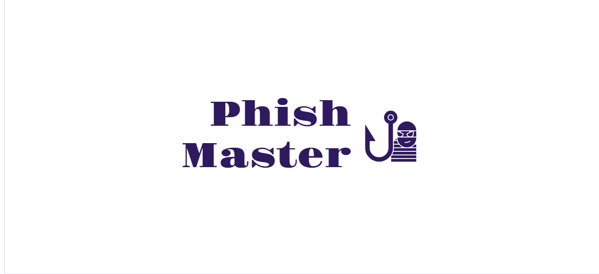

<h1 align="center">Phish Master 🚀</h1>
<br>



[](https://github.com/Armoghans-Organization/Phish-Master/blob/main/LICENSE)


## Overview 🌐
Phish Master is a powerful phishing tool designed for educational purposes. It allows users to create and deploy custom phishing campaigns to simulate real-world cyber attacks. With Phish Master, users can craft convincing phishing emails or web pages and track interactions to assess their organization's security posture.

## Features 🌟
- **Custom Phishing Campaigns 🎯:** Easily create and customize phishing emails and web pages.
- **Template Library 📚:** Access a variety of pre-made templates for different phishing scenarios.
- **Interaction Tracking 🕵️:** Monitor and log interactions to analyze the effectiveness of your campaigns.
- **Analytics Dashboard 📊:** View detailed reports and statistics on campaign performance.
- **Scheduling Campaigns 🗓️:** Schedule campaigns to run at specific times for more realistic simulations.

##  Getting Started 🚀

### Prerequisites ✅
- Node.js 
- npm 
- SQLite 
- Python
- pip 

### Installation 💻

1. **Clone the repository:**
   ```bash
    git clone https://github.com/Armoghans-Organization/Phish-Master.git
   cd Phish-Master
   ```
2. **Install NPM dependencies:**
    ```bash
      npm run install-all
    ```
3. **Install PYTHON dependencies:**
    ```bash
      pip install -r requirements.txt
    ```
4. **Run database migrations:**
Ensure your database schema is up to date by running the migrations from the database.py file.
    ```bash
      python database.py
    ```
5. **Run the application:**
    ```bash
    npm start
    ```
6. **Access the application:**
 
    Open your browser and navigate to [http://localhost:5000](http://localhost:5000).

## Usage 📖
### Creating a Campaign 🛠️
1. Log in to the Phish Master dashboard.
2. Navigate to the "Campaigns" section.
3. Click on "Create New Campaign" and follow the prompts to customize your phishing email or web page.
4. Launch the campaign and track interactions in real-time.

### Monitoring and Reporting 📈
1. Use the Analytics Dashboard to view detailed metrics and reports on your campaigns.
2. Export reports in various formats (CSV, PDF) for further analysis.
   
## Advanced Features ⚙️
### Email Templates 📧
Utilize a wide range of email templates to simulate various phishing scenarios. Customize these templates to match the look and feel of legitimate communications, making your campaigns more effective.

### Landing Pages 🌐
Create realistic landing pages that mimic popular websites. Track user interactions on these pages to gauge the success of your phishing attempts.

### Scheduling Campaigns ⏰
Schedule your phishing campaigns to run at specific times. This feature allows for more realistic simulations, as real-world phishing attacks often occur at opportune moments.


## Contributing 🤝
We welcome contributions to Phish Master! If you'd like to contribute, please follow these steps:

1. Fork the repository.
2. Create a new branch (git checkout -b feature-branch).
3. Make your changes and commit them (git commit -m 'Add new feature').
4. Push to the branch (git push origin feature-branch).
5. Open a Pull Request.

## Legal Disclaimer ⚠️
Phish Master is intended for educational purposes only. Unauthorized use of this tool for malicious purposes is strictly prohibited. The developers of Phish Master assume no liability for any misuse or damage caused by the tool.

## License 📜
Phish Master is licensed under the [MIT License](https://github.com/Armoghans-Organization/Phish-Master/blob/main/LICENSE). See the LICENSE file for more details

## Contact 📬
For any questions or inquiries, please contact us at [armoghan16@gmail.com](mailto:armoghan16@gmail.com).